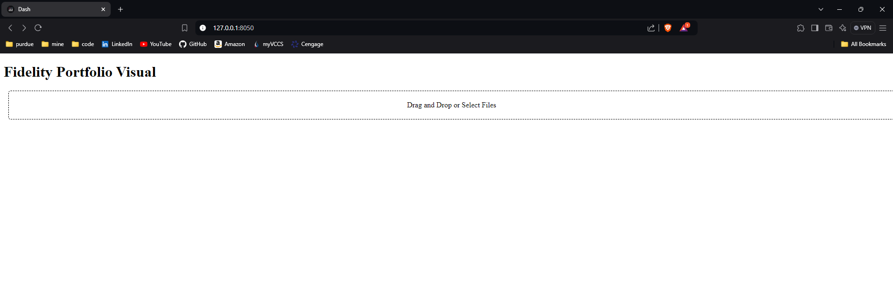
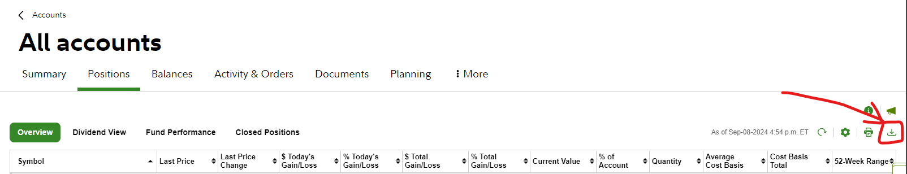

# fidelity-portfolio-visual

## Usage
This project is set up to be run in a dockerized container. The site can be run with: 
```
make docker-build
make docker-run
```
Once the container is up, the site for this project defaults to `localhost:8050`, and the default site looks like such: 



To use this tool, a csv from a Fidelity portfolio must first be exported. This can be done by hitting the button in the picture below when looking at the **All Accounts** fiew in Fidelity. 



Save the csv export with the **default name that fidelity gives it**. To spot check, the naming format that fidelity follows the format of `Portfolio_Positions_<MMM-DD-YYYY>.csv`. **Proper name format of the file is critical for the program to run**. 